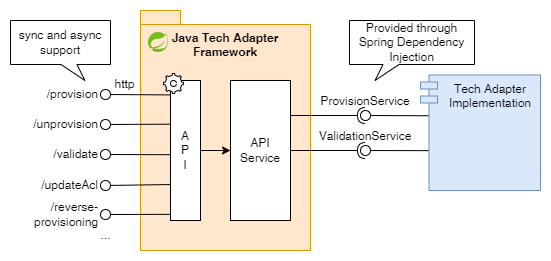

# High Level Design

This High Level Design defines the Java Tech Adapter Framework design, a Spring Boot based framework to streamline the experience of creating Witboost tech adapters by standardizing common features, namely the API layer, descriptor parsing, base configuration, etc. This also allows to introduce new features and fix issues faster and without the need to propagate the feature or fix to all developed Java tech adapters.

The base for this Framework will follow the existing [Java scaffold](https://github.com/agile-lab-dev/witboost-java-scaffold), and will take most of the implementation as-is, improving the existing base features to allow complete use of the potential of Witboost tech adapters.

At a high level, the features this framework should provide are:

- Support for the whole Tech Adapter OpenAPI specification v2.2.0 at API level with plans to update to newer versions of the API (current version as of 01/08/2024 is 2.6.0).
- Implement the API layer of a typical Java Tech Adapter, including appropriate error handling with support for the full error schema
- Provide extension points to define provisioning and validation business logic with a well-defined interface.
- Support to both component level and data product level provisioning. 
- Descriptor parsing and the possibility to configure the expected component `specific` schema for component level operations.
    - Possibility to configure the request `params` schema for ReverseProvisioning requests

Parsing the input to the framework model, and validating said input will be decoupled operations, allowing the framework to handle all possible parsing errors, and providing an interface to validate the parsed input against the specific environment or technology for which the Tech Adapter is developed.

Thus, the interface must provide all the necessary information that the business logic may need to perform all its operations. This includes the following items, but more may be necessary:

- Complete parsed descriptor/request, including data product information
    - Requests must contain all possible fields as per the specification. Optional fields should be marked accordingly
- For component level provisioning: Component to provision parsed with the appropriate schema
    - Other components not to be provisioned are also correctly parsed as JSON but not decoded as a class
- For validation operation: As this task is executed during different operations, the type of Operation being performed

## Spring Boot
We will continue to use Spring Boot as the underlying API framework and leveraging the Spring facilities to achieve the wiring between the framework API layer and the business logic by using Spring's Dependency Injection.

We may provide default behaviour on the interfaces which return Not Implemented errors for each method.

## Sync/async operations
The framework must support both synchronous and asynchronous operations. This should be handled via configuration, and its implementation should be transparent to the tech adapter implementation, which will only implement the (sync) business logic interface. The asynchronous pool handling shall be done by the framework. The configuration shall provide:

- Enable/disable async provisioning
- The implementation type of the repository, following WIT-229 design. As a first implementation, only the Cache (in-memory) strategy will be implemented

## OpenTelemetry
Currently, we provide integration with OpenTelemetry as part of the Java Scaffold project. This integration should remain at the Java scaffold level, as not to impose this tool onto the framework users. Thus, an OpenTelemetry dependency should not be present on the framework.

## Java Scaffold
The Java Scaffold should be rewritten to remove the API layer and instead including the framework as a dependency, injecting the business logic by implementing the necessary interfaces.

The scaffold will still contain artifacts like the Dockerfile, Helm chart, documentation, and of course, the business logic.

### Helm
Explore the possibility to have a base chart that could be used as-is or extended for each provisioner, so that we also deduplicate the several charts we have.

## Migration
The idea of creating the framework is not only to facilitate the creation of future tech adapters, but also to migrate the existing Java and Scala tech adapters to use it and standardize all of our repositories. The migration should be performed only when the framework can support all the tech adapter features that a certain adapter implementation uses.

For example, the Databricks Tech Adapter uses asynchronous operations, so unless the frameworks supports them, it cannot be migrated as we must avoid missing existing features when migrating.

There are other instances, like the ADLS Gen2 Output Port Tech Adapter which slightly modifies the ValidationService interfaces provided by the scaffold to account for the use case it solves. Because of this is necessary to analyze the existing implementations to support them on the framework, else it would be of no use for said tech adapter.

For this purpose, we must provide a sensible guide on how to migrate existing Java and Scala tech adapters to use this framework. 
