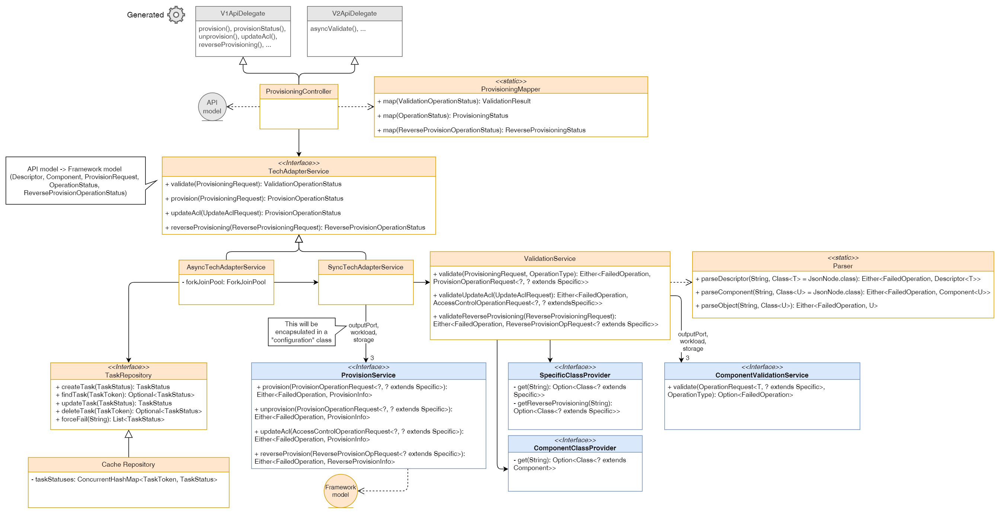
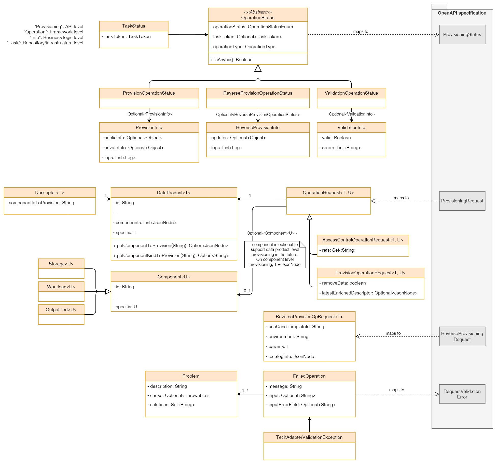
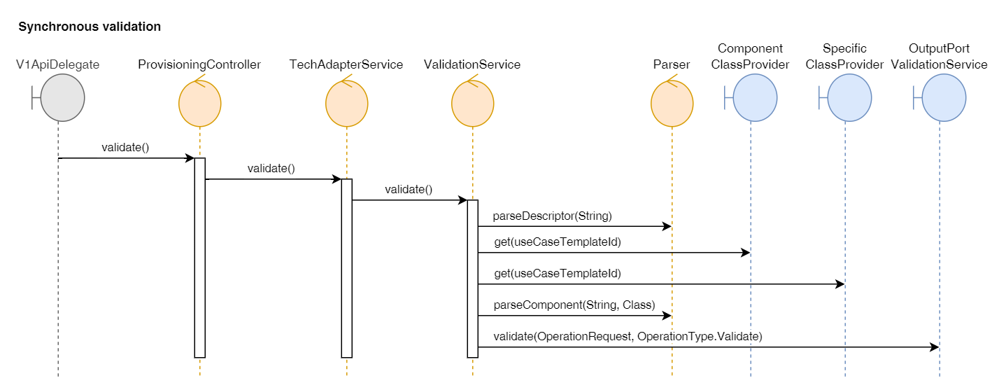
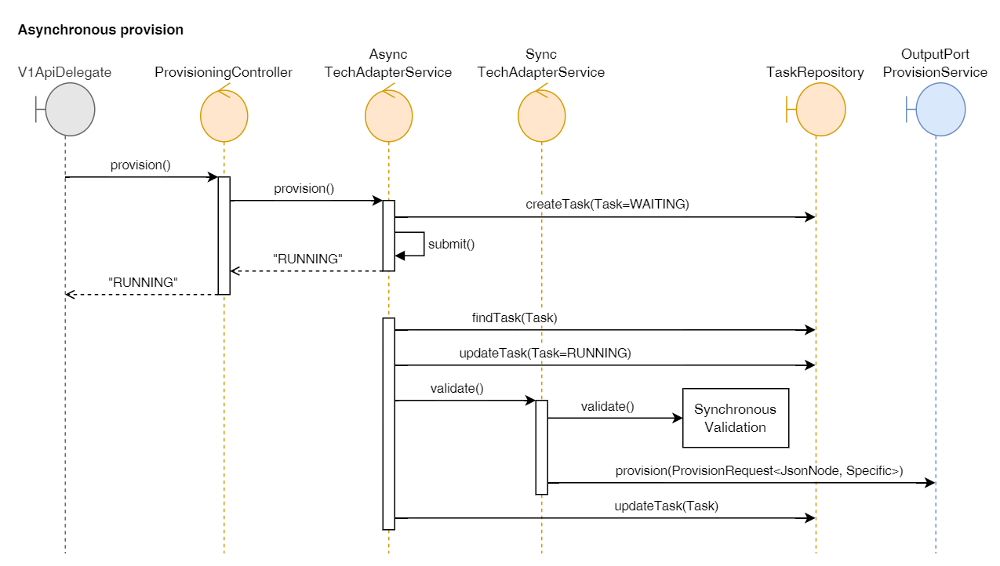

# Low Level Design

## Glossary

- **Tech Adapter**: an API interface (usually implemented via a microservice or a lambda) responsible for the validation, provisioning, import and access control of components inside Witboost, acting as bridge between Witboost and the target technologies of a system.
- **Framework**: a set of reusable software components that provide a structure for application development. In this case, it refers to the common features needed to bootstrap and implement a Witboost Tech Adapter.
- **Operation**: one of the actions a Tech Adapter is expected to perform against a target technology. This includes validation, provisioning, unprovisioning, update access control, import resources (a.k.a. reverse provisioning) and more. Operations are defined on the API specification of a Tech Adapter, and are invoked by Witboost Provisioning Coordinator.
- **Asynchronous operation**: Operations that don't wait for the operation outcome and return it synchronously, but rather "immediately" return a token that can be used at a later point in time to query the Tech Adapter for that operation outcome. This translates into an architecture that may support concurrent operations, and that implements state storage.


## Overview

The Java Tech Adapter Framework is a Spring Boot based framework to streamline the experience of creating Witboost tech adapters by standardizing common features, namely the API layer, descriptor parsing, base configuration, etc. This also allows to introduce new features and fix issues faster and without the need to propagate the feature or fix to all developed Java tech adapters.

This framework is the evolution of the current [Java scaffold](https://github.com/agile-lab-dev/witboost-java-scaffold), which acts as a base project from which developers can develop their Java Tech Adapters, providing already a base structure, API layer and other components like deployment artifacts (Dockerfile, Helm chart), monitoring (OpenTelemetry integration) and more. This project has been successful on speeding up the development process but struggles when fixes or new features need to be implemented to the scaffold, as these changes should be propagated to the forked repositories, but this generally is slow due to the large amount of existing Tech Adapters forked on different moments of the scaffold lifespan.  

For this reason, we design the Java Tech Adapter Framework not as a base project that can be forked, but as a package that can be installed as a dependency on a new project and that provides extension points to introduce the custom business logic each new Teach Adapter requires. 

At a high level, the features this framework should provide are:

- Support for the whole Tech Adapter OpenAPI specification v2.2.0 with plans to update to newer versions of the API in the future (current version as of 01/08/2024 is 2.6.0).
- Implement the API layer of a typical Java Tech Adapter, including appropriate error handling with support for the full error schema
- Provide extension points to define business logic with a well-defined interface.
- Descriptor parsing and the possibility to configure the expected component `specific` schema for operations having the descriptor as main input.
    - Possibility to configure the request `params` schema for ReverseProvisioning requests


## Requirements

- As a **platform team member**, I want to have a starting point to implement Tech Adapters for my specific use cases, so that development times are faster and to ensure that the Tech Adapter is compliant with the specification defined by Witboost.
- As a **framework developer**, I want to be able to introduce new features and bugfixes to the common layers of all Tech Adapters without the burden to update each of my affected repositories even for non-breaking changes.


## Design

The framework is designed to abstract the common features of a Java Tech Adapter. This includes:
- API layer which will be autogenerated using `openapi-generator-maven-plugin` v7.5.0.
- Descriptor and component parsing, providing the possibility for the Tech Adapter developer to specify the `specific` field class model, as well as the Reverse Provisioning `params` field.
- Error handling supporting the full Witboost error schema
- Handling of asynchronous operations, including thread pools, state storage, etc.

The framework will be designed under two modules: Artifact name `java-tech-adapter-framework-model` under package `com.witboost.provisioning.model` which will containing the model and parsing facilities, and `java-tech-adapter-framework-core` under package `com.witboost.provisioning.framework` which will contain the Spring Boot services, provisioning flow classes and the interfaces defining the extension points.

### Core

The core module will include the Spring Boot service classes and will handle the provisioning flow, exposing the extension points of the framework which are the following:
- Synchronous provision service interface, in order to provide the business logic for all operations.
- Synchronous validation service interface, to provide the component/data product validation business logic. This includes validations specific to the Tech Adapter use case or environment, common validations like schema compliance, malformed input, parse errors, etc. are handled by the framework.
- Specific models mapping, providing an extension point to define the model classes for both the `specific` field for the data product and component descriptor, and the `params` field on a Reverse Provision request based on a configured useCaseTemplateId. This will be required by the first version, and then improvements can be made to automatize this process (e.g. via custom annotations and class path scanning).
- Component model mapping, providing an extension point to define the component classes to use to parse a certain useCaseTemplateId, in order to allow for components who have extra metadata fields than the ones provided by default. This will be required by the first version, and then improvements can be made to automatize this process (e.g. via custom annotations and class path scanning).

These three interfaces are defined as follows:

- **Sync provision service interface**
```java
interface ProvisionService {
  Either<FailedOperation, ProvisionInfo> provision(ProvisionOperationRequest<?, ? extends Specific> operationRequest);
  Either<FailedOperation, ProvisionInfo> unprovision(ProvisionOperationRequest<?, ? extends Specific> operationRequest);
  Either<FailedOperation, ProvisionInfo> updateAcl(AccessControlOperationRequest<?, ? extends Specific> operationRequest);
  Either<FailedOperation, ReverseProvisionInfo> reverseProvision(ReverseProvisionOperationRequest<? extends Specific> operationRequest);
}
```

- **Sync validation service interface**
```java
interface ComponentValidationService {
  Either<FailedOperation, Void> validate(OperationRequest<?, ? extends Specific> operationRequest, OperationType operationType);
}
```

- **Specific model mapping**
```java
interface SpecificClassProvider {
  Option<Class<? extends Specific>> get(String useCaseTemplateId);
  Optiol<Class<? extends Specific>> getReverseProvisioningParams(String useCaseTemplateId);
}
```

- **Component model mapping**
```java
interface ComponentClassProvider {
  Option<Class<? extends Component>> get(String useCaseTemplateId);
}
```

Provide base implementation for the last two 

The general class diagram for the `java-tech-adapter-framework-core` module is shown below. On grey, the autogenerated classes, on blue the extension points.



As the diagram shows, the provision and validation extension points are one per each component kind. This will be designed as an intermediate "Configuration" object which effectively will be the extension point for the user.

The "Configuration" objects which encapsulate the one-per-each-kind interfaces shall be implemented in such a way that the Tech Adapter developer can quickly build the object with only the necessary overrides from the provided default behaviour. For this purpose, the Builder pattern should be used, provided by the Lombok `@Builder` annotation. This Configuration object will also allow to introduce support to other components and data-product level provisioning in a quicker way.

#### Spring Boot

These extension points will be modeled as interfaces and integrated with the framework provisioning flow via Spring Beans. For each interface, default methods will be provided returning errors for each operation, and for each Bean (the "Configuration" objects), a default implementation (a pattern known as AutoConfiguration) marked with `@ConditionalOnMissingBean` should be provided, using the default behaviour for each interface.

Tech adapter developers will override this behaviour by implementing the provided interfaces, creating the "Configuration" objects for provision and validation, and marking them with the appropriate Spring annotation (mainly `@Service`).


### Model

The `java-tech-adapter-framework-model` module will contain the model of the framework and is designed as a mapping from the OpenAPI specification raw string and classes to a more sophisticated structure, including parsed components and helper methods. The diagram below shows only some of the most important sections of the model. The model is then to be assumed equal to the current Java Scaffold model except what is shown differently on the diagram, including some class renaming.



OperationRequest contains two generics which are intended for the Specific schema of the data product and the component to provision respectively, allowing data product level provisioning with a single interface. For this purpose, the Component attribute is marked as Optional and thus the business logic implementation must check for the presence of said object before accessing any information.

For Reverse Provisioning, a separate object is provided since this operation input is different.

As for the return types, we define two levels of abstraction. First, the return types of the diverse business logic operations, including only the information each operation can return via the corresponding endpoint. Secondly, an abstract OperationStatus class, containing the base information of an operation at framework level, allowing the usage of asynchronous operations in the framework and leaving the business logic sync-pure; this OperationStatus will enable to store any type of operation result with a single interface onto the async task repository. As this class is used for both synchronous and asynchronous operations, the token attribute is marked as optional and is used as the discriminator between sync and async results. 


### Operation flow

The flow for a certain operation follows roughly the steps already existing on the Java Scaffold:

1. The request is received and Spring parses it to the API layer objects
2. The request is parsed to the framework model, creating an Operation Request.
3. The component is validated by calling the validation business logic.
4. The operation is performed by calling the provisioning business logic.
   - The provision service to be called is chosen by looking at the `kind` field on the component to provision, and for the reverse provision the `spec.mesh.kind` field on the input catalog-info.
5. The framework returns the result to the user

For asynchronous operations, steps are added to handle the submission on the tasks' pool.

1. Same as synchronous flow
2. A task is created with status "WAITING", and stored on the Task Repository
3. The framework returns a "RUNNING" result to the user.
4. The task is executed, following points 2-4 of the synchronous flow.
5. The task is updated on the Task Repository and the operation concludes

For more details about the async provisioning flow, check WIT-229.

The sequence diagrams for these two scenarios are shown below.






## Development lifecycle

The development will be performed in an incremental way, roughly following these milestones:

- Synchronous support for validate, provision, unprovision, updateAcl and reverseProvisioning at component level provisioning.
- Asynchronous support for validate, provision, unprovision, updateAcl and reverseProvisioning at component level provisioning.
- Synchronous and asynchronous support for data product level provisioning.

This will allow to iteratively improve the framework and to support migration of existing Tech Adapters at different moments during the implementation. Each of these milestones will be released under a minor version, unless breaking changes are identified during the development process. In this case, a major version will be released.

### Migration

Migration of existing Tech Adapters shall be coordinated with the introduction of features on the Java Tech Adapter Framework as explained above. This framework is designed with this migration in mind, as the structure of the framework related to the existing Tech Adapters is roughly similar. As long as the existing Tech Adapters keep the validation and provisioning business logic decoupled from the API layer, the migration should be smooth. 

For this purpose, a guide should be designed in order to migrate existing Tech Adapters, both Java and Scala, to this framework. This should include the following aspects:

- Beans to be implemented for the business logic
  - It must include an equivalence guide between the current Scaffold classes and model, with the new classes and model defined for the framework (e.g. old `ProvisionRequest<T>` is equivalent to new `OperationRequest<JsonNode, T>`).
- Framework configuration documentation


## Error Handling

The framework must support the whole Witboost error structure, providing the model to create sensible errors and include the appropriate information (input, input field, set of problems and solutions, etc.). The current Java Scaffold uses the `FailedOperation` class for this purpose, but this lacks some of the fields a Witboost error could have. The improved model is shown in the class diagram above. We may improve it using a Builder pattern to facilitate the creation of the error, provided by the Lombok `@Builder` annotation.

The API layer shall handle the errors through a Spring Boot Exception Handler `@RestControllerAdvice`, so it's the task of the `TechAdapterService` to transform the functional return types to throw an appropriate exception that will be caught by the framework. Except some Runtime exceptions, they shall also be caught and returned as `500 Internal Server Error` errors by creating a Witboost error containing the most information possible. Some notable exceptions are:

- `ConstraintViolationException`: Thrown by Jakarta library when validation through a `@Validated/@Valid` annotation failed. This exception contains valuable information that can be used. This should return a `400 Bad Request` error, as it is related to input validation.


## Interactions

### Liveness and readiness

The framework must provide base liveness and readiness endpoints to be used when deploying a Tech Adapter on a cluster. These are provided [out-of-the-box](https://docs.spring.io/spring-boot/reference/actuator/endpoints.html#actuator.endpoints.kubernetes-probes) by Spring Boot Actuator by setting `management.endpoint.health.probes.enabled=true`.


## Security

The framework doesn't contain any sensitive information, and any added by the Tech Adapter implementation should be provided using Spring configuration files.

The framework is configured without any authentication/authorization by default, but it should be designed to not limit the user to inject their own mechanisms using Spring Boot at a later point if needed. Logging should be configured by default to mask authentication and keys from request bodies.


## Logging

Logging will be handled using Spring logs, in conjunction with the Logbook library which provides the flexibility to define the logs being produced. This library will allow the framework to log the request body and the response body of each response, correlating them via a `correlationId`. All log configurations (both for Spring and Logbook) must be done via configuration files.

Aside from request/response body logging, the framework must log extensively during the provisioning flow. As most of the process is designed in a pure-functional way, logs are the only tool to understand if an error occurred during the operation. For this reason, every time a `Either.left` is created and returned, this must be accompanied by a log of said error with at least a WARNING level, with the necessary information to understand what/when/why something failed.

INFO logs must be logged on every major step of the process to understand the flow of a certain operation. It must include all the necessary information to identify the operation that performed that log, as on asynchronous operations the logs may not be shown in sequential order and may intertwine with other operation logs. INFO logs shouldn't be too long in content, but must be informative and useful for debugging and audit purposes.

DEBUG logs may be used on the most complex parts of the processes with the purpose of logging more information about the request (class instances information, configurations, etc.). We must avoid to log any sensitive information.


## Configuration

We consider two types of configuration. Static configuration provided via `application.yml` files, and dynamic configuration related to the injection of the business logic implementation.

Static configuration will be handled via Spring `application.yml` file, and it must already provide an appropriate default configuration for the framework:
- Asynchronous is disabled by default
  - Each operation, except `validate` as it provides two different endpoints, will be able to override the asynchronous flag to handle their results. 
- Logbook is configured to log request/response body, including a correlationId and masking any sensitive Authorization and X-API-Key headers.
- Liveness and readiness enabled by default

The mechanism for Dynamic configuration is explained above, in order to inject the interface implementation by adding Spring annotations.


## Dependencies

We shall use the same dependencies and their versions used on the Java Scaffold, with the following exceptions:

- `openapi-generator-maven-plugin` 7.5.0
- Remove Micrometer dependencies


## Packaging

We should package the framework with two jars: A model module and the provisioning flow module, published on Maven central.

As the modules will be created with package `com.witboost`, we must also [register the domain](https://central.sonatype.org/register/central-portal/) on Maven Central to be able to publish under said domain.